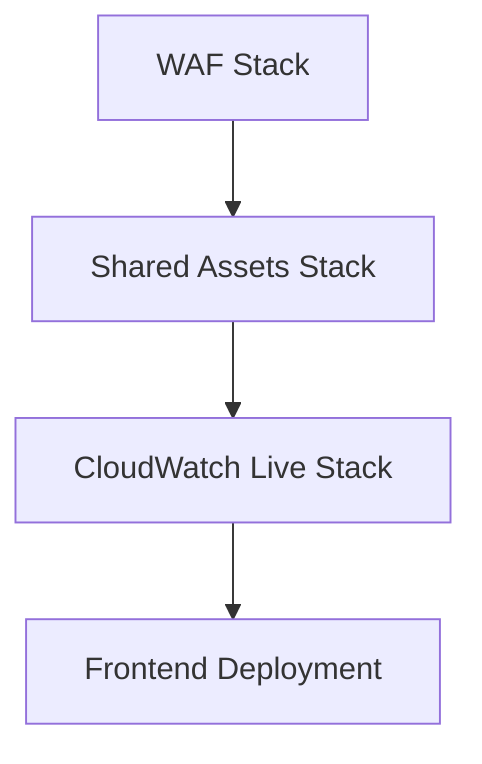

# CloudWatch Live - Mono Repository

A comprehensive AWS-based application for real-time CloudWatch log monitoring and management, built with a modern serverless architecture.

## 📋 Table of Contents

- [Overview](#overview)
- [Architecture](#architecture)
- [Project Structure](#project-structure)
- [Getting Started](#getting-started)
- [Deployment](#deployment)
- [Development](#development)
- [Stack Management](#stack-management)
- [Contributing](#contributing)

## 🎯 Overview

CloudWatch Live is a real-time log monitoring and management platform that provides:

- **Real-time log streaming** from AWS CloudWatch
- **Advanced filtering and search** capabilities
- **User management** with role-based access control
- **Multi-tenant architecture** with organization support
- **Modern React frontend** with Next.js
- **Serverless backend** using AWS AppSync, Lambda, and DynamoDB

## 🏗 Architecture

The application follows a multi-stack serverless architecture:

- **Frontend**: Next.js React application hosted on CloudFront
- **Backend**: AWS AppSync GraphQL API with Lambda resolvers
- **Database**: DynamoDB for user data and configurations
- **Authentication**: Amazon Cognito for user management
- **Security**: AWS WAF for application protection
- **Infrastructure**: CloudFormation for IaC deployment

### Multi-Region Deployment
- **WAF Stack**: `us-east-1` (required for CloudFront integration)
- **Application Stacks**: `ap-southeast-2` (Sydney)

## 📁 Project Structure

```
nl-mono-repo/
├── packages/
│   ├── cloudwatchlive/          # Main application
│   │   ├── backend/             # AppSync API, Lambda functions
│   │   └── frontend/            # Next.js React application
│   ├── cwl-waf/                 # Web Application Firewall
│   ├── deploy/                  # Deployment orchestration
│   ├── shared/                  # Shared utilities and types
│   └── shared-aws-assets/       # Shared AWS infrastructure
├── scripts/                     # Build and deployment scripts
└── [configuration files]
```

### Package Details

| Package | Description | Region |
|---------|-------------|---------|
| `cloudwatchlive` | Main application (frontend + backend) | ap-southeast-2 |
| `cwl-waf` | Web Application Firewall rules | us-east-1 |
| `shared-aws-assets` | VPC, KMS, shared infrastructure | ap-southeast-2 |
| `deploy` | Deployment orchestration and CLI | - |
| `shared` | Common utilities and types | - |

## 🚀 Getting Started

## 🚀 Getting Started

### Prerequisites

- **Node.js 18+** and **Yarn**
- **AWS CLI** configured with appropriate permissions
- **AWS Account** with CloudFormation, IAM, and service permissions

### Installation

1. **Clone the repository**
   ```bash
   git clone <repository-url>
   cd nl-mono-repo
   ```

2. **Install dependencies**
   ```bash
   yarn install
   ```
   Lerna will automatically install dependencies for all workspace packages.

3. **Set up environment variables**
   ```bash
   # Copy example environment file
   cp packages/deploy/.env.example packages/deploy/.env
   
   # Edit with your AWS credentials
   vim packages/deploy/.env
   ```

## 🚢 Deployment

The project offers multiple deployment strategies to suit different use cases and security requirements.

### Option 1: Modern TypeScript Deployment (Recommended)

Use the comprehensive TypeScript deployment tool for the best experience:

```bash
# Interactive deployment - walks you through all options
cd packages/deploy
npm run deploy

# Deploy all stacks with admin user
npm run deploy all --stage dev --admin-email admin@company.com

# Update specific stack and dependencies
npm run update:shared --stage dev
```

**Features:**
- ✅ Interactive CLI with guided prompts
- ✅ Smart dependency management
- ✅ Automatic admin user creation
- ✅ Real-time deployment progress
- ✅ Comprehensive error handling
- ✅ Frontend build and deployment

See [packages/deploy/README.md](packages/deploy/README.md) for complete documentation.

### Option 2: Quick CloudFormation Script

For rapid prototyping and simple deployments:

```bash
# One-command deployment with CloudFormation
chmod +x ./scripts/cfn-one-deploy.sh
./scripts/cfn-one-deploy.sh
```

**Best for:**
- Quick testing and demos
- Simple AWS setups
- Getting started quickly

### Option 3: Manual Stack Deployment

For granular control over each deployment step:

### Option 3: Manual Stack Deployment

For granular control over each deployment step:

```bash
# Deploy in this specific order
yarn deploy-waf    --stage dev  # WAF (us-east-1)
yarn deploy-shared --stage dev  # Shared assets (ap-southeast-2)
yarn deploy-cwl    --stage dev  # CloudWatch Live (ap-southeast-2)
```

### Deployment Order & Dependencies



**Stack Dependencies:**
- **WAF**: Independent, deployed first
- **Shared Assets**: Depends on WAF, provides shared infrastructure
- **CloudWatch Live**: Depends on Shared Assets for VPC, KMS, etc.

## 💻 Development

### Local Development

Start the development environment:

```bash
# Start frontend development server
yarn dev-cwl

# This will start the Next.js dev server on http://localhost:3000
```

### Building for Production

```bash
# Build all packages
yarn build

# Build specific package
cd packages/cloudwatchlive/frontend
yarn build
```

### Testing

```bash
# Run tests for all packages
yarn test

# Run tests for specific package
cd packages/cloudwatchlive/backend
yarn test
```

## 🔧 Stack Management

### Updating Stacks

The deployment tool provides smart update capabilities:

```bash
# Update shared stack and automatically redeploy dependent CWL stack
npm run update:shared --stage dev

# Update only WAF (no dependencies)
npm run update:waf --stage dev

# Update only CWL (no dependents)
npm run update:cwl --stage dev
```

### Frontend-Only Updates

For quick frontend updates without backend changes:

```bash
cd packages/deploy

# Build and deploy frontend
npm run frontend:build --stage dev
npm run frontend:upload --stage dev
npm run frontend:invalidate --stage dev

# Or all at once
npm run deploy:frontend --stage dev
```

### Monitoring Deployments

Monitor deployment progress through:
- **AWS CloudFormation Console** - Stack events and status
- **Deployment Logs** - Real-time deployment output
- **CloudWatch Logs** - Lambda function logs during deployment

## 🗑 Stack Removal

Remove stacks in reverse dependency order:

```bash
# Remove all stacks
yarn remove-all --stage dev

# Or remove individually (in this order)
yarn remove-cwl --stage dev     # CloudWatch Live first
yarn remove-shared --stage dev  # Shared assets second  
yarn remove-waf --stage dev     # WAF last
```

## 🔐 Security & Access Control

### AWS Permissions Required

The deployment requires these AWS permissions:
- **CloudFormation**: Full access for stack management
- **IAM**: Role and policy management
- **S3**: Bucket creation and object management
- **Lambda**: Function deployment and execution
- **AppSync**: GraphQL API management
- **Cognito**: User pool and identity management
- **DynamoDB**: Table creation and management
- **CloudFront**: Distribution management
- **WAF**: Web application firewall rules

### User Management

After deployment, admin users can:
- Create and manage organizations
- Set up user access controls
- Configure CloudWatch log access
- Manage API permissions

## 📚 Additional Documentation

- [Deployment Guide](packages/deploy/README.md) - Comprehensive deployment documentation
- [Frontend Documentation](packages/cloudwatchlive/frontend/README.md) - Frontend development guide
- [Backend Documentation](packages/cloudwatchlive/backend/README.md) - Backend API documentation
- [AWS STS Guide](AWS-STS-GUIDE.md) - Secure deployment with temporary credentials
- [CFN Deployment Instructions](CFN_DEPLOYMENT_INSTRUCTIONS.md) - CloudFormation deployment details

## 🤝 Contributing

1. Fork the repository
2. Create a feature branch: `git checkout -b feature-name`
3. Make your changes and test thoroughly
4. Commit your changes: `git commit -am 'Add feature'`
5. Push to the branch: `git push origin feature-name`
6. Submit a pull request

### Development Workflow

1. **Local Testing**: Test changes locally with `yarn dev-cwl`
2. **Deploy to Dev**: Use `npm run deploy all --stage dev`
3. **Testing**: Verify functionality in dev environment
4. **Staging**: Deploy to staging for final testing
5. **Production**: Deploy to production after approval

## 📄 License

This project is licensed under the MIT License - see the LICENSE file for details.

## 🆘 Support

For issues and questions:
1. Check existing [documentation](packages/deploy/README.md)
2. Review [troubleshooting guides](packages/deploy/README.md#troubleshooting)
3. Create an issue with detailed information about your problem

## ⚡ Quick Reference

### Most Common Commands

```bash
# 🚀 Deploy everything (recommended for new projects)
cd packages/deploy && npm run deploy all --stage dev --admin-email admin@company.com

# 🔄 Update shared infrastructure and dependencies
cd packages/deploy && npm run update:shared --stage dev

# 🌐 Deploy frontend only
cd packages/deploy && npm run deploy:frontend --stage dev

# 💻 Start local development
yarn dev-cwl

# 🧹 Remove everything
yarn remove-all --stage dev
```

### Stack Commands

```bash
# Individual stack deployment
yarn deploy:waf --stage dev     # Deploy WAF only
yarn deploy:shared --stage dev  # Deploy shared assets only  
yarn deploy:cwl --stage dev     # Deploy CloudWatch Live only

# Smart updates (deploys dependencies automatically)
cd packages/deploy
npm run update:waf --stage dev     # Update WAF (no dependencies)
npm run update:shared --stage dev  # Update shared + CWL (dependent)
npm run update:cwl --stage dev     # Update CWL only
```

### Environment Stages

- **dev** - Development environment
- **staging** - Staging/testing environment  
- **prod** - Production environment

---

**Made with ❤️ for real-time AWS CloudWatch log monitoring**


