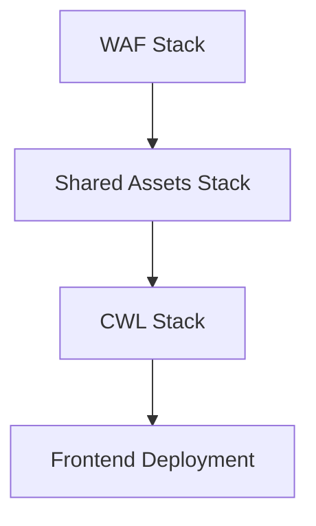

# Nathan Loudon's AWS Monorepo

⚠️ **IMPORTANT: This monorepo uses YARN, not npm. All AI agents and developers should use `yarn` commands.**

A comprehensive monorepo containing AWS-based applications and shared infrastructure, built with modern serverless architecture and TypeScript.

## 📋 Table of Contents

- [Overview](#overview)
- [Architecture](#architecture)
- [Project Structure](#project-structure)
- [Getting Started](#getting-started)
- [Deployment](#deployment)
- [Development](#development)
- [Multi-Agent Workflow](#multi-agent-workflow)
- [Stack Management](#stack-management)
- [Contributing](#contributing)

## 🎯 Overview

This monorepo contains multiple AWS applications and shared infrastructure components developed by Nathan Loudon:

### Current Applications

**CloudWatch Live (CWL)** - An event management platform that provides:

- **Event scheduling and management** for conferences, meetings, and live events
- **YouTube Live streaming integration** for each event session
- **User management** with role-based access control for different event roles
- **Multi-tenant architecture** with organization and company support
- **Modern React frontend** with Next.js
- **Serverless backend** using AWS AppSync, Lambda, and DynamoDB

### Shared Infrastructure

- **Deployment orchestration** - Comprehensive TypeScript-based deployment tools
- **AWS shared assets** - VPC, KMS, IAM, and other foundational infrastructure
- **Common utilities** - Shared types, functions, and development tools

## 🏗 Architecture

The monorepo follows a multi-stack serverless architecture with shared infrastructure:

### Application Architecture (CWL)

- **Frontend**: Next.js React application hosted on CloudFront
- **Backend**: AWS AppSync GraphQL API with Lambda resolvers
- **Database**: DynamoDB for user data, events, and session management
- **Authentication**: Amazon Cognito for user management with role-based access
- **Streaming**: YouTube Live API integration for event sessions
- **Security**: AWS WAF for application protection
- **Infrastructure**: CloudFormation for Infrastructure as Code deployment

### Shared Infrastructure

- **VPC & Networking**: Shared networking resources across applications
- **KMS**: Centralized encryption key management
- **IAM**: Shared roles and policies for cross-stack access
- **S3**: Template storage and shared asset buckets

### Multi-Region Deployment

- **WAF Stack**: `us-east-1` (required for CloudFront integration)
- **Application Stacks**: `ap-southeast-2` (Sydney)

## 📁 Project Structure

```
nl-mono-repo/
├── packages/
│   ├── cloudwatchlive/          # Event management platform
│   │   ├── backend/             # AppSync API, Lambda functions
│   │   └── frontend/            # Next.js React application
│   ├── waf/                     # Web Application Firewall
│   ├── deploy/                  # Deployment orchestration
│   ├── shared/                  # Shared utilities and types
│   └── shared-aws-assets/       # Shared AWS infrastructure
├── scripts/                     # Build and deployment scripts
└── [configuration files]
```

### Package Details

| Package             | Description                                          | Region         |
| ------------------- | ---------------------------------------------------- | -------------- |
| `cloudwatchlive`    | Event management and YouTube Live streaming platform | ap-southeast-2 |
| `waf`               | Web Application Firewall rules                       | us-east-1      |
| `shared-aws-assets` | VPC, KMS, shared infrastructure                      | ap-southeast-2 |
| `deploy`            | Deployment orchestration and CLI                     | -              |
| `shared`            | Common utilities and types                           | -              |

## 🚀 Getting Started

### Prerequisites

- **Node.js 18+** and **Yarn**
- **AWS CLI** configured with appropriate permissions
- **AWS Account** with CloudFormation, IAM, and service permissions

### Quick Start

1. **Clone the repository**

   ```bash
   git clone <repository-url>
   cd nl-mono-repo
   ```

2. **Install dependencies**

   ```bash
   yarn install
   ```

3. **Set up environment variables**

   ```bash
   cp packages/deploy/.env.example packages/deploy/.env
   # Edit with your AWS credentials
   ```

4. **Deploy to AWS**

   ```bash
   # Interactive deployment with guided prompts
   cd packages/deploy
   yarn deploy

   # The interactive tool will guide you through:
   # - Stage selection (dev, staging, prod)
   # - Admin email setup
   # - Stack deployment in correct order
   ```

5. **Start development**

   ```bash
   # Interactive development menu with arrow key navigation
   yarn dev-menu

   # Or run specific commands:
   yarn development     # Deploy/update AWS infrastructure
   yarn dev:local       # Start dev server (local)
   yarn dev:codespaces  # Start dev server (Codespaces)
   ```

## �️ Development

### Development Commands

| Command               | Description                                                    |
| --------------------- | -------------------------------------------------------------- |
| `yarn dev-menu`       | Interactive development menu (use ↑/↓ arrows, Enter to select) |
| `yarn development`    | Deploy/update AWS infrastructure                               |
| `yarn dev:local`      | Run frontend dev server locally                                |
| `yarn dev:codespaces` | Run frontend dev server in Codespaces                          |
| `yarn build-gql`      | Generate GraphQL types                                         |

### Environment-Specific Development

**For Local Development:**

```bash
yarn dev:local
# Frontend available at: http://localhost:3000
```

**For GitHub Codespaces:**

```bash
yarn dev:codespaces
# Frontend available at forwarded port (Codespaces will show the URL)
```

## 🚢 Deployment

The project uses a comprehensive TypeScript-based deployment tool with an interactive CLI that guides you through the entire deployment process.

### Quick Deployment

```bash
# Interactive deployment with guided prompts
cd packages/deploy
yarn deploy

# The tool will:
# 1. Prompt you to select the deployment stage (dev, staging, prod)
# 2. Ask for an admin email to create the initial admin user
# 3. Deploy all stacks in the correct dependency order
# 4. Handle stuck stacks and resource cleanup automatically
# 5. Create admin user and validate deployment
```

### Deployment Output

During deployment, you'll see progress updates for each step:

```bash
? Enter admin email address for user creation: admin@example.com
[SUCCESS] AWS credentials initialized
[SUCCESS] Successfully deployed WAF stack in us-east-1
[SUCCESS] Successfully deployed Shared stack in ap-southeast-2
[SUCCESS] CWL infrastructure deployment completed successfully
[SUCCESS] Frontend build completed successfully
[SUCCESS] Frontend deployment completed successfully!
[SUCCESS] Admin user setup completed successfully!
[SUCCESS] All stacks deployed successfully.
```

The deployment process includes:

1. **Infrastructure deployment** - All AWS stacks in correct dependency order
2. **Frontend build and deployment** - Next.js application built and uploaded to S3/CloudFront
3. **Admin user creation** - Cognito user and DynamoDB record creation
4. **Validation** - Ensuring all components are working correctly

### Deployment Features

- ✅ **Interactive CLI** with guided prompts for all deployment options
- ✅ **Smart dependency management** - automatically handles stack dependencies
- ✅ **Multi-region support** - manages WAF (us-east-1) and application stacks (ap-southeast-2)
- ✅ **Automatic admin user creation** in Cognito and DynamoDB
- ✅ **Real-time deployment progress** with detailed logging
- ✅ **Comprehensive error handling** with automatic retry and cleanup
- ✅ **Frontend build and deployment** with CloudFront cache invalidation
- ✅ **Stack update capabilities** with dependency detection

### Alternative Commands

```bash
# Legacy deployment command (still works)
cd packages/deploy
yarn development

# Direct CLI deployment (skips interactive prompts)
cd packages/deploy
yarn deploy all --stage dev --admin-email admin@example.com
```

For updating specific stacks and their dependencies:

```bash
# Interactive updates with prompts for stage selection
cd packages/deploy
yarn update
```

See [packages/deploy/README.md](packages/deploy/README.md) for complete documentation.

### Deployment Order & Dependencies



**Stack Dependencies:**

- **WAF**: Independent, deployed first
- **Shared Assets**: Depends on WAF, provides shared infrastructure
- **CWL (CloudWatch Live)**: Depends on Shared Assets for VPC, KMS, etc.

## 💻 Development

### Development Commands

| Command          | Description                       |
| ---------------- | --------------------------------- |
| `yarn dev`       | Start frontend development server |
| `yarn deploy`    | Deploy the application            |
| `yarn build-gql` | Build GraphQL schemas             |
| `yarn build`     | Build all packages                |
| `yarn lint`      | Lint all packages                 |
| `yarn tsc`       | Run TypeScript compiler checks    |
| `yarn test`      | Run tests                         |

### Additional Utility Scripts

| Command                      | Description                         |
| ---------------------------- | ----------------------------------- |
| `yarn reset-modules`         | Remove all node_modules directories |
| `yarn install-aws-cli-local` | Install AWS CLI locally             |

> **Note:** For deployment commands, use `cd packages/deploy && yarn <command>`. See [Deployment](#deployment) section below.

### Local Development

**For Local Development:**

```bash
yarn dev:local
# Frontend available at: http://localhost:3000
```

**For GitHub Codespaces:**

```bash
yarn dev:codespaces
# Frontend available at forwarded port (Codespaces will show the URL)
```

### Building for Production

```bash
# Build all packages
yarn build

# Build specific package
cd packages/cloudwatchlive/frontend
yarn build
```

### Testing

```bash
# Run tests for all packages
yarn test

# Run tests for specific package
cd packages/cloudwatchlive/backend
yarn test
```

## 🤖 Multi-Agent Workflow

This repository supports **parallel development with multiple AI coding agents** using Git worktrees. This enables true concurrent development on different features without conflicts.

### Quick Start

```bash
# Create worktrees for parallel development
git worktree add ../nl-mono-repo-agent-1 -b agent-1
git worktree add ../nl-mono-repo-agent-2 -b agent-2

# Install dependencies in each worktree
cd ../nl-mono-repo-agent-1 && yarn install
cd ../nl-mono-repo-agent-2 && yarn install

# Open each worktree in separate VS Code windows
code /path/to/nl-mono-repo-agent-1 -n
code /path/to/nl-mono-repo-agent-2 -n
```

### Agent Responsibilities

**Agent 1 - Backend/Infrastructure:**

- `packages/cloudwatchlive/backend/` - Lambda functions, AppSync resolvers
- `packages/deploy/` - CloudFormation templates, deployment scripts
- Backend business logic and database schema

**Agent 2 - Frontend/UI:**

- `packages/cloudwatchlive/frontend/` - React components, pages, routing
- `packages/shared/` - Shared utilities and types
- UI components and GraphQL integration

### Benefits

- ✅ **Complete isolation** - Each agent has its own file system and dependencies
- ✅ **Separate branches** - Clean Git workflow with independent feature branches
- ✅ **No conflicts** - True parallel development without file locking
- ✅ **Standard workflow** - Merge through pull requests like team members

### Documentation

See [MULTI_AGENT_WORKFLOW.md](MULTI_AGENT_WORKFLOW.md) for comprehensive documentation including:

- Detailed setup instructions
- Agent coordination strategies
- Merge workflows and best practices
- Troubleshooting guide
- Complete example workflows

See [WORKTREE_STATUS.md](WORKTREE_STATUS.md) for quick reference of active worktrees and commands.

## 🔧 Stack Management

### Updating Stacks

The deployment tool provides smart update capabilities through an interactive CLI:

```bash
cd packages/deploy

# Launch the interactive update process
yarn update

# The tool will:
# 1. Prompt you to select the stage (dev, staging, prod)
# 2. Let you choose which stack to update (WAF, Shared, or CWL)
# 3. Automatically identify and update dependent stacks
# 4. Handle the update process with real-time progress
```

**Smart Dependency Management:**

- **Updating WAF**: No dependent stacks need updating
- **Updating Shared Assets**: Automatically prompts to redeploy the dependent CWL stack
- **Updating CWL**: No dependent stacks need updating

### Frontend-Only Updates

For quick frontend updates without backend changes:

```bash
cd packages/deploy

# Launch the interactive frontend deployment
yarn deploy:frontend

# The tool will:
# 1. Prompt you to select the stage (dev, staging, prod)
# 2. Build the frontend application
# 3. Upload the build to the S3 bucket
# 4. Invalidate the CloudFront distribution cache
```

### Monitoring Deployments

Monitor deployment progress through:

- **AWS CloudFormation Console** - Stack events and status
- **Deployment Logs** - Real-time deployment output
- **CloudWatch Logs** - Lambda function logs during deployment

## 🗑 Stack Removal

The deployment tool provides a comprehensive stack removal process with enhanced user feedback and progress tracking:

```bash
# Interactive removal with guided prompts
cd packages/deploy
yarn remove

# The tool will:
# 1. Prompt you to select the stage (dev, staging, prod)
# 2. Show you which stacks exist for the selected stage
# 3. Let you choose which stacks to remove
# 4. Confirm removal with a single confirmation prompt
# 5. Remove stacks in the correct dependency order with real-time progress
```

### Removal Features

- ✅ **Enhanced user feedback** with real-time progress updates
- ✅ **Single confirmation prompt** - no repeated confirmations during removal
- ✅ **Multi-region support** - handles WAF stack in us-east-1 automatically
- ✅ **Proper dependency order** - removes stacks in reverse dependency order
- ✅ **Error suppression** - hides confusing "stack does not exist" messages after successful deletion
- ✅ **Comprehensive logging** - detailed progress information throughout the process

### Removal Order

The tool handles removal in the correct dependency order:

1. **CWL Stack** (removed first)
2. **Shared Assets Stack** (removed second)
3. **WAF Stack** (removed last)

### Alternative Removal Commands

```bash
# Direct CLI removal (skips interactive prompts)
cd packages/deploy
yarn remove all --stage dev

# Remove specific stacks
yarn remove:cwl --stage dev
yarn remove:shared --stage dev
yarn remove:waf --stage dev
```

> **Important:** The WAF stack is deployed in `us-east-1` (required for CloudFront integration), while other stacks are in `ap-southeast-2`. The deployment tool handles this regional difference automatically.

## 🔐 Security & Access Control

### AWS Permissions Required

The deployment requires these AWS permissions:

- **CloudFormation**: Full access for stack management
- **IAM**: Role and policy management
- **S3**: Bucket creation and object management
- **Lambda**: Function deployment and execution
- **AppSync**: GraphQL API management
- **Cognito**: User pool and identity management
- **DynamoDb**: Table creation and management
- **CloudFront**: Distribution management
- **WAF**: Web application firewall rules

### User Management

After deployment, the system automatically creates the following user groups in Cognito:

- **SuperAdmin**: Full system access and administration
- **EventCompanyAdmin**: Event company administration access
- **EventCompanyStaff**: Event company staff access
- **TechCompanyAdmin**: Technical company administration access
- **TechCompanyStaff**: Technical company staff access
- **RegisteredAttendee**: Registered event attendee access
- **UnregisteredAttendee**: Basic attendee access

The admin user created during deployment is assigned to the **SuperAdmin** group with full access to:

- Create and manage events and sessions
- Set up user access controls for different event roles
- Configure YouTube Live streaming for event sessions
- Manage API permissions and organization settings
- Administer all user groups and permissions

## 📚 Additional Documentation

- [Multi-Agent Workflow Guide](MULTI_AGENT_WORKFLOW.md) - Parallel development with Git worktrees
- [Worktree Status](WORKTREE_STATUS.md) - Active worktrees quick reference
- [Deployment Guide](packages/deploy/README.md) - Comprehensive deployment documentation
- [Frontend Documentation](packages/cloudwatchlive/frontend/README.md) - Frontend development guide
- [Backend Documentation](packages/cloudwatchlive/backend/README.md) - Backend API documentation
- [AWS STS Guide](AWS-STS-GUIDE.md) - Secure deployment with temporary credentials
- [CFN Deployment Instructions](CFN_DEPLOYMENT_INSTRUCTIONS.md) - CloudFormation deployment details
- [Yarn Usage Guide](YARN_USAGE.md) - Yarn-specific commands and workflows

## 🤝 Contributing

1. Fork the repository
2. Create a feature branch: `git checkout -b feature-name`
3. Make your changes and test thoroughly
4. Commit your changes: `git commit -am 'Add feature'`
5. Push to the branch: `git push origin feature-name`
6. Submit a pull request

### Development Workflow

1. **Local Testing**: Test changes locally with `yarn dev:local` or `yarn dev:codespaces`
2. **Deploy to Dev**: Use `cd packages/deploy && yarn deploy` (select dev stage when prompted)
3. **Testing**: Verify functionality in dev environment
4. **Staging**: Deploy to staging for final testing (select staging stage when prompted)
5. **Production**: Deploy to production after approval (select prod stage when prompted)

## 📄 License

This project is licensed under the MIT License - see the LICENSE file for details.

## 🆘 Support

For issues and questions:

1. Check existing [documentation](packages/deploy/README.md)
2. Review [troubleshooting guides](packages/deploy/README.md#troubleshooting)
3. Create an issue with detailed information about your problem

## 🔍 Troubleshooting

### Common Issues

#### Stack Deployment Failures

- **Failed stacks are automatically cleaned up** - The deployment tool detects failed stacks and removes them before retrying
- **Check AWS permissions** - Ensure your AWS credentials have the necessary permissions for all services
- **Verify stack outputs** - The tool validates that all required CloudFormation exports are present

#### Stack Removal Issues

- **Use the interactive removal tool** - `cd packages/deploy && yarn remove` provides enhanced feedback and handles multi-region complexity
- **WAF stack region** - The WAF stack is in `us-east-1`, not `ap-southeast-2`. The tool handles this automatically
- **Dependency order** - Stacks are removed in reverse dependency order to prevent deletion failures

#### Frontend Issues

- **Environment variables** - The frontend automatically reads deployment outputs from CloudFormation
- **CloudFront caching** - Frontend deployments automatically invalidate the CloudFront cache
- **Build failures** - Check that all required environment variables are set in the deployment outputs

#### Multi-Region Complexity

- **WAF resources** - Must be in `us-east-1` for CloudFront integration
- **Application stacks** - Deployed in `ap-southeast-2` but reference WAF resources from `us-east-1`
- **Automatic handling** - The deployment tool manages cross-region dependencies automatically

### Getting Help

For issues and questions:

1. Check the [deployment documentation](packages/deploy/README.md) for detailed troubleshooting
2. Review CloudFormation stack events in the AWS Console
3. Check CloudWatch logs for Lambda function errors
4. Create an issue with detailed error messages and deployment logs

---

**Made with ❤️ for creating seamless event management and YouTube Live streaming experiences**
