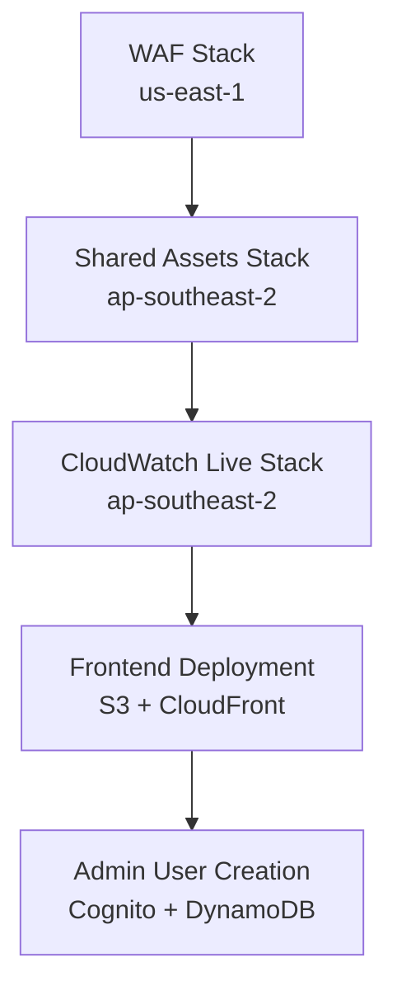

# CloudWatch Live Deployment Tool

This package contains the comprehensive deployment orchestration system for the CloudWatch Live application stack. It provides an interactive CLI that guides you through deployment, updates, and removal processes with smart dependency management and multi-region support.

## ✨ Features

- 🎯 **Interactive CLI** with guided prompts for all operations
- 🔗 **Smart dependency management** - automatically handles stack dependencies
- 🌍 **Multi-region support** - manages WAF (us-east-1) and application stacks (ap-southeast-2)
- 👤 **Automatic admin user creation** in Cognito and DynamoDB
- 📊 **Real-time progress tracking** with detailed logging
- 🛡️ **Comprehensive error handling** with automatic retry and cleanup
- 🌐 **Frontend deployment** with CloudFront cache invalidation
- 🔄 **Stack update capabilities** with dependency detection
- 🗑️ **Enhanced removal process** with single confirmation and progress feedback

## 📋 Prerequisites

- **Node.js 18+** and **Yarn**
- **AWS CLI** configured with appropriate permissions
- **AWS Account** with permissions for CloudFormation, IAM, S3, Cognito, AppSync, Lambda, DynamoDB, CloudFront, and WAF services

## 🚀 Quick Start

### Installation

```bash
cd packages/deploy
yarn install
```

### Environment Setup

Create a `.env` file in the **mono-repo root directory** with your AWS credentials:

```bash
AWS_ACCESS_KEY_ID=your_access_key
AWS_SECRET_ACCESS_KEY=your_secret_key
AWS_ACCOUNT_ID=your_12_digit_account_id
```

## 📖 Usage

### Interactive Deployment (Recommended)

The interactive mode provides guided prompts for all deployment operations:

```bash
# Full interactive deployment
yarn deploy

# Interactive stack updates
yarn update

# Interactive frontend deployment
yarn deploy:frontend

# Interactive stack removal
yarn remove
```

### Command Line Interface

For automated deployments or CI/CD pipelines:

```bash
# Deploy all stacks in correct order
yarn deploy all --stage dev --admin-email admin@example.com

# Deploy specific stacks
yarn deploy:waf --stage dev
yarn deploy:shared --stage dev
yarn deploy:cwl --stage dev

# Update stacks with dependencies
yarn update:shared --stage dev  # Also updates dependent CWL stack
yarn update:waf --stage dev     # No dependencies
yarn update:cwl --stage dev     # No dependents

# Frontend operations
yarn deploy:frontend --stage dev
yarn frontend:build --stage dev
yarn frontend:upload --stage dev
yarn frontend:invalidate --stage dev

# Stack removal
yarn remove all --stage dev
yarn remove:cwl --stage dev
yarn remove:shared --stage dev
yarn remove:waf --stage dev
```

## 🔧 Command Options

| Option                  | Description                                | Default                      |
| ----------------------- | ------------------------------------------ | ---------------------------- |
| `--stage <stage>`       | Deployment stage (dev, staging, prod)      | `dev`                        |
| `--admin-email <email>` | Admin user email for Cognito user creation | Required for full deployment |
| `--skip-user-creation`  | Skip admin user creation during deployment | `false`                      |
| `--no-auto-delete`      | Disable auto-deletion of failed stacks     | `false`                      |
| `--aws-region <region>` | AWS Region for application stacks          | `ap-southeast-2`             |

## 🌍 Environment Variables

| Variable                | Description           | CLI Alternative       |
| ----------------------- | --------------------- | --------------------- |
| `ADMIN_EMAIL`           | Admin user email      | `--admin-email`       |
| `AWS_REGION`            | AWS Region            | `--aws-region`        |
| `AWS_ACCESS_KEY_ID`     | AWS Access Key ID     | AWS CLI configuration |
| `AWS_SECRET_ACCESS_KEY` | AWS Secret Access Key | AWS CLI configuration |

## 👤 Admin User Management

During deployment, the system automatically creates an admin user with the following setup:

### User Creation Process

1. **Cognito User Groups**: Creates SuperAdmin, Admin, and User groups
2. **User Account**: Creates user in Cognito User Pool with provided email
3. **Password Setup**: Sets permanent password `Temp1234!` (must be changed on first login)
4. **Group Assignment**: Adds user to SuperAdmin group
5. **Database Record**: Creates user record in DynamoDB user table
6. **Validation**: Validates successful user creation

### Default Admin User Details

- **Email**: Specified via `--admin-email` or `ADMIN_EMAIL` environment variable
- **Password**: `Temp1234!` (temporary - must be changed on first login)
- **Groups**: SuperAdmin (full access)
- **Default Profile**: John Doe, Mr, 0421 569 854

## 🏗️ Architecture & Dependencies

### Stack Deployment Order



### Stack Dependencies

- **WAF Stack**: Independent, deployed first (us-east-1 region)
- **Shared Assets**: Depends on WAF, provides shared infrastructure (ap-southeast-2)
- **CloudWatch Live**: Depends on Shared Assets for VPC, KMS, etc. (ap-southeast-2)
- **Frontend**: Depends on CWL stack for S3 bucket and CloudFront distribution
- **Admin User**: Depends on CWL stack for Cognito User Pool and DynamoDB table

## 🛠️ Advanced Usage

### Updating Stack Dependencies

The deployment tool automatically manages dependencies:

```bash
# Update shared stack - will prompt to update dependent CWL stack
yarn update:shared --stage dev

# Update CWL stack only - no dependents to update
yarn update:cwl --stage dev

# Update WAF stack only - no dependents to update
yarn update:waf --stage dev
```

### Frontend-Only Deployments

For quick frontend updates without backend changes:

```bash
# Interactive frontend deployment
yarn deploy:frontend

# Or individual steps:
yarn frontend:build --stage dev
yarn frontend:upload --stage dev
yarn frontend:invalidate --stage dev
```

### Stack Removal

The enhanced removal process provides better feedback and handles multi-region complexity:

```bash
# Interactive removal with progress tracking
yarn remove

# Direct removal commands
yarn remove all --stage dev           # Remove all stacks
yarn remove:cwl --stage dev          # Remove CWL stack only
yarn remove:shared --stage dev       # Remove shared stack only
yarn remove:waf --stage dev          # Remove WAF stack only
```

**Removal Features:**

- ✅ Single confirmation prompt before destructive actions
- ✅ Real-time progress updates during removal
- ⚠️ Automatic dependency order (CWL → Shared → WAF)
- 🌍 Multi-region support (handles WAF in us-east-1 automatically)
- 🔇 Suppresses confusing "stack does not exist" errors after successful deletion

## 🐛 Troubleshooting

### Common Issues

#### User Creation Failures

- **AWS Permissions**: Verify AWS credentials have Cognito and DynamoDB permissions
- **Stack Outputs**: Ensure CloudFormation stacks have completed successfully and all outputs are available
- **Region Configuration**: Check that the correct region is configured for application stacks

#### Failed Stack Recovery

- **Automatic Cleanup**: Failed stacks are automatically deleted and redeployed by default
- **Manual Override**: Use `--no-auto-delete` flag to disable automatic cleanup for debugging
- **Stack Dependencies**: Ensure dependent stacks are deployed in the correct order

#### Multi-Region Issues

- **WAF Region**: WAF stack must be in `us-east-1` for CloudFront integration
- **Application Region**: Application stacks are deployed in `ap-southeast-2` by default
- **Cross-Region References**: The tool automatically handles cross-region CloudFormation exports/imports

#### Frontend Deployment Issues

- **Build Failures**: Check that all required environment variables are set
- **S3 Upload Errors**: Verify S3 bucket exists and has correct permissions
- **CloudFront Issues**: Cache invalidation may take 5-15 minutes to propagate

### Debugging Tips

1. **Check CloudFormation Events**: Review stack events in AWS Console for detailed error information
2. **Examine Deployment Outputs**: Check `deployment-outputs.json` for stack output values
3. **Validate Permissions**: Ensure AWS credentials have all required service permissions
4. **Review Logs**: Check CloudWatch logs for Lambda function execution details

## 📋 Examples

### Complete Development Setup

```bash
# Deploy everything for development
cd packages/deploy
yarn deploy all --stage dev --admin-email dev-admin@company.com
```

### Update Workflow (Most Common)

```bash
# Update shared infrastructure and dependent CWL stack
cd packages/deploy
yarn update:shared --stage dev
```

### Frontend Update Only

```bash
# Quick frontend update without backend changes
cd packages/deploy
yarn deploy:frontend --stage dev
```

### Production Deployment

```bash
# Deploy to production environment
cd packages/deploy
yarn deploy all --stage prod --admin-email prod-admin@company.com
```

### Complete Environment Removal

```bash
# Remove all stacks for a stage
cd packages/deploy
yarn remove all --stage dev
```
